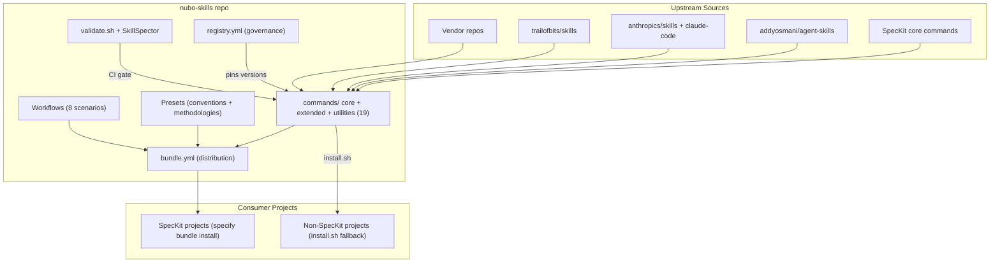
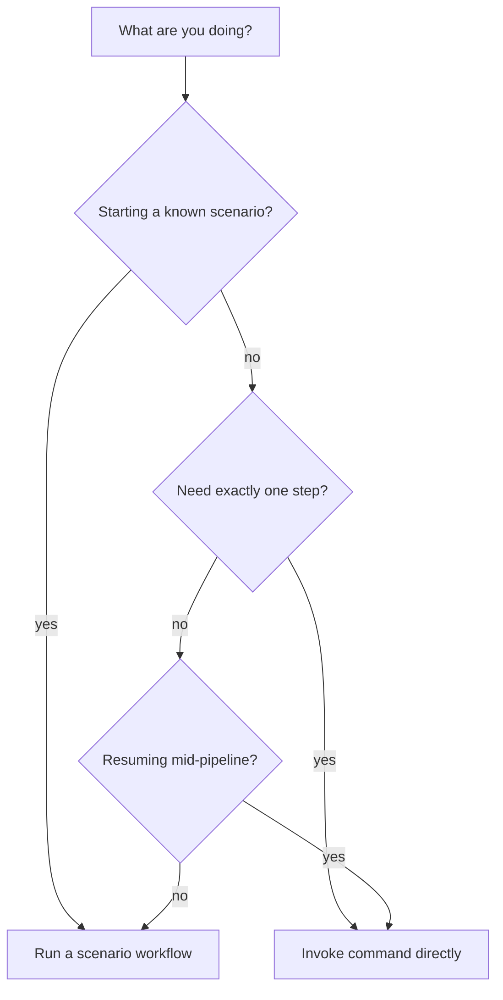
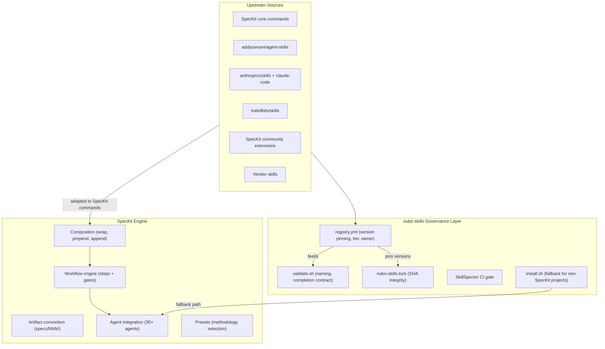
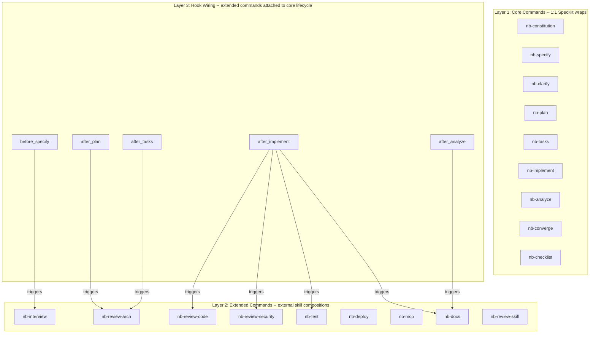

# nubo-skills Governance Layer

## Research Context

This plan is informed by the current (mid-2026) agent skills ecosystem:

- **agentskills.io open standard** -- The SKILL.md format is a cross-platform standard supported by ~40 platforms (Cursor, Claude Code, Codex, Copilot, Gemini CLI, etc.). Frontmatter requires `name` (lowercase kebab, max 64 chars, must match directory name) and `description` (max 1024 chars). Optional: `license`, `compatibility`, `metadata`, `allowed-tools`. Body is freeform markdown. Three-level loading: metadata at startup, full SKILL.md on activation, resources on demand.

- **SpecKit preset composition** -- SpecKit (github/spec-kit) supports `strategy: wrap` in presets, where a `{CORE_TEMPLATE}` placeholder is substituted with the resolved lower-priority content. This enables injecting content before/after core commands without replacing them. Composition is recursive across a priority stack. This is the upstream model nubo-skills should leverage for SpecKit-sourced skills.

- **Enterprise governance gap** -- 669K+ skills exist on skills.sh (Vercel's public registry) with zero curation. CSA research shows automated scanners are bypassed. Industry consensus (Sonika Janagill, Chainguard, SkillReg) is that enterprises need an internal governed registry with: named owners, tier classification (green/amber/red), version pinning with SHA integrity, approval workflows, deprecation dates, and coexistence testing.

- **Private registry products** -- Chainguard Agent Skills and SkillReg offer private registries with versioning, SHA pinning, and org-scoped access. nubo-skills takes a lighter-weight git-native approach that achieves the same governance without a hosted service dependency.

- **Curated vs flat catalogs** -- The ecosystem splits between flat catalogs (skills.sh, SkillsMP) and curated/categorized ones (explainx.ai, Anthropic Official, tech-leads-club Agent Skills Registry with 80 human-reviewed skills). Phase-aware organization is a Nubo-specific layer on top of categorization.

- **Battle-tested upstream skill sets** -- Four repositories provide the upstream skills: `anthropics/skills` (163K stars, official Anthropic skills, Apache 2.0), `addyosmani/agent-skills` (79.8K stars, 24 skills organized by SDLC phase, based on Google's engineering practices), `trailofbits/skills` (6.1K stars, 74 security sub-skills with CodeQL/Semgrep/SARIF), and `anthropics/claude-code` (frontend-design plugin). Distribution via `vercel-labs/skills` CLI (`npx skills add`). nubo-skills composes these into `nb-{command}` commands rather than authoring custom definitions.

- **Agent-agnostic distribution** -- SpecKit supports 30+ agents by maintaining a canonical skill set and an integration layer that maps skills into each agent's specific directory at install time (`.cursor/skills/`, `.claude/skills/`, `.agents/skills/`, etc.). nubo-skills stores commands in agentskills.io layout (`nb-{command}/SKILL.md`) under `commands/{core,extended,utilities}/`, distributed via SpecKit bundle (primary) or `install.sh` copy (fallback) targeting any agent via `--agent <key>`.

- **Distribution patterns** -- Three documented patterns exist for enterprise skill distribution in 2026:
  1. **Git-native registry** (Connor O'Kane's [internal registries](https://www.connorokane.io/blog/internal-agent-skill-registries-and-scanning-them-with-skillspector/), gmackie's [skills-distribution-model](https://github.com/gmackie/agent-skills/blob/master/docs/skills-distribution-model.md), localskills.sh's [private registry guide](https://localskills.sh/blog/private-skill-registry)) -- A git repo IS the registry. PR-gated changes, CI validation (SkillSpector), consumers install via `npx skills add org/repo` or git submodule + symlinks. Repo-wide access control only.
  2. **OCI artifact registry** (Chainguard's `chainctl skills push/install` at `skills.cgr.dev/org/skill:tag`) -- Skills as OCI artifacts with per-skill access control, SHA digest pinning, and org-scoped entitlements. Requires hosted service.
  3. **Registry-mediated CLI** (Parlance Labs' `@parlance-labs/skills` with `SKILLS_REGISTRY_TOKEN`) -- Forked `npx skills` routing installs through a private registry server. Server-mediated downloads fail closed. npm as optional transport (`npm:@scope/pkg@version`).
  
  nubo-skills follows the **git-native registry** pattern, the lightest-weight option with no hosted service dependency. The pattern's documented limitation (repo-wide access control only) is acceptable since all skills are internal to the organization.

---

## Architecture Overview

nubo-skills is a standalone git repo that acts as the single source of truth for every skill consumed by Nubo development teams. Projects never install upstream skills directly; they depend on nubo-skills, which adapts all upstream content into SpecKit commands and distributes them via a SpecKit bundle (primary) or a fallback install script (for non-SpecKit projects).



---

## 1. Repository Structure

```
nubo-skills/
  registry.yml                      # single source of truth for all skill entries
  nubo-skills.lock                  # resolved versions + SHA256 integrity hashes

  upstream/                         # vendored/submoduled upstream content
    speckit/                        # git submodule pinned to exact tag
    addyosmani/                     # git submodule: addyosmani/agent-skills (79.8K stars)
    anthropics/                     # git submodule: anthropics/skills (163K stars)
    trailofbits/                    # git submodule: trailofbits/skills (6.1K stars)
    vendor/                         # other git submodules (e.g. pimcore/skills)

  commands/                         # agentskills.io layout: nb-{command}/SKILL.md per command
    core/                           # Layer 1: 1:1 SpecKit wraps (9 commands)
      nb-constitution/
        SKILL.md                      # wrap    | speckit-constitution
      nb-specify/
        SKILL.md                      # wrap    | speckit-specify
      nb-clarify/
        SKILL.md                      # wrap    | speckit-clarify
      nb-plan/
        SKILL.md                      # wrap    | speckit-plan
      nb-tasks/
        SKILL.md                      # wrap    | speckit-tasks
      nb-implement/
        SKILL.md                      # wrap    | speckit-implement
      nb-analyze/
        SKILL.md                      # wrap    | speckit-analyze
      nb-converge/
        SKILL.md                      # wrap    | speckit-converge
      nb-checklist/
        SKILL.md                      # wrap    | speckit-checklist

    extended/                       # Layer 2: external skill compositions (9 commands)
      nb-interview/
        SKILL.md                      # merge   | interview-me + idea-refine
      nb-review-code/
        SKILL.md                      # merge   | code-review + simplification + perf
        references/                   #   progressive disclosure split files
          review-perf.md
          review-simplification.md
      nb-review-security/
        SKILL.md                      # merge   | security-hardening + static-analysis (trailofbits)
      nb-review-arch/
        SKILL.md                      # sequence | 3 SpecKit arch extensions
        references/
          arch-guard-steps.md
          arch-preview-steps.md
          arch-contract-steps.md
      nb-test/
        SKILL.md                      # merge   | browser-testing + webapp-testing
      nb-deploy/
        SKILL.md                      # merge   | ship + cicd + git + observability + deprecation
        references/
          deploy-shipping.md
          deploy-cicd.md
          deploy-git.md
          deploy-observability.md
          deploy-deprecation.md
      nb-mcp/
        SKILL.md                      # standalone | mcp-builder
      nb-docs/
        SKILL.md                      # standalone | documentation-and-adrs
      nb-review-skill/
        SKILL.md                      # standalone | custom (Nubo-authored)

    utilities/                      # Reactive tools, not pipeline commands (1 command)
      nb-debug/
        SKILL.md                      # utility | debugging-and-error-recovery

  presets/                          # SpecKit presets for Nubo conventions + methodology selection
    nb-conventions/                 # wraps all commands with Nubo governance + context-engineering practices
    nb-tdd/                         # injects TDD skills (tdd + doubt-driven) into nb-implement
    nb-frontend/                    # injects frontend skills (frontend-ui + frontend-design) into nb-implement

  workflows/                        # SpecKit-native workflow definitions
    registry.yml                    # scenario catalog: when to use each workflow
    nb-greenfield.yml               # bootstrap project from zero (no docs, no constitution)
    nb-feature-pipeline.yml           # standard new feature on SDD-ready project
    nb-brownfield-onboard.yml         # adopt SDD on existing codebase without artifacts
    nb-hotfix.yml                   # small scoped change, minimal ceremony
    nb-review-only.yml              # review + test for existing code
    nb-security-audit.yml           # security-focused pass (no implement)
    nb-docs-catchup.yml             # generate missing ADRs/docs from codebase
    nb-arch-alignment.yml           # architecture drift remediation

  bundle.yml                        # SpecKit bundle definition for distribution

  scripts/
    validate.sh                     # naming, completion contract, registry consistency
    sync-upstream.sh                # pull pinned upstream versions into upstream/
    upgrade.sh                      # bump a pinned version + regenerate lock
    install.sh                      # fallback installer for non-SpecKit projects (--agent, --phases)

  integrations/                     # agent-specific context/rule files
    agents.yml                      # maps agent keys to discovery paths
    prompts-guide.md                # maps User Prompts to agent-specific APIs (AskQuestion, AskUserQuestion, etc.)
    context-files/                  # per-agent rule/context templates
      cursor.md                     # .cursor/rules/ template
      claude.md                     # CLAUDE.md managed block
      codex.md                      # AGENTS.md managed block
      gemini.md                     # GEMINI.md managed block
```

### Command directory convention (agentskills.io aligned)

Every command uses the **agentskills.io standard layout** — symmetric across all 19 commands regardless of layer, strategy, or file count:

```
commands/{layer}/nb-{command}/
  SKILL.md              # required; frontmatter name must match directory name
  references/           # optional; progressive disclosure (>500 lines)
  scripts/              # optional; executable helpers
  assets/               # optional; templates, static resources
```

Rules enforced by `validate.sh`:
- Directory name = frontmatter `name` = `nb-{command}` (lowercase, hyphens, max 64 chars)
- Main file is always `SKILL.md` (case-sensitive), never `nb-{command}.md`
- Optional subdirectories follow agentskills.io: `references/`, `scripts/`, `assets/`
- Body under 500 lines; split to `references/` when exceeded

**Install mapping:**
- **SpecKit path** (`specify bundle install`): `SKILL.md` content mapped into SpecKit extension command format under `.specify/extensions/nubo-skills/`
- **Fallback path** (`install.sh`): directories copied as-is to agent skill paths (e.g. `.cursor/skills/nb-specify/SKILL.md`) — no format conversion needed

---

## 2. Unified Naming Convention

Pattern: **`nb-{command}`** -- aligned with SpecKit's flat convention (`speckit-specify`, `speckit-plan`).

**Directory layout (agentskills.io):** `commands/{layer}/nb-{command}/SKILL.md` -- directory name equals frontmatter `name`. Optional `references/`, `scripts/`, `assets/` subdirectories per the open standard.

- `nb-` prefix -- short, consistent, org-scoped (mirrors `speckit-` prefix)
- `{command}` -- descriptive name for the composed procedure

Examples:
- `nb-specify`, `nb-clarify`, `nb-plan`, `nb-tasks`, `nb-implement` -- core SDD pipeline
- `nb-mcp` -- specialized implementation domain
- `nb-tdd`, `nb-frontend` -- presets that augment `nb-implement` (not separate commands)
- `nb-review-code`, `nb-review-security`, `nb-review-arch` -- review procedures
- `nb-test` -- testing
- `nb-deploy` -- deployment lifecycle
- `nb-docs` -- documentation
- `nb-debug` -- utility (not a pipeline command)

Commands compose multiple upstream skills -- the `nb-` name represents the composed procedure, not a 1:1 vendor mapping. The phase is not encoded in the name (it lives in `registry.yml` and in the workflow step ordering). The composition is declared in `registry.yml` so it is auditable and enforceable by the CLI.

---

## 3. Registry and Version Governance

### registry.yml

Inspired by the governance registries recommended by the enterprise skills governance community (Chainguard, SkillReg, Sonika Janagill's enterprise audit registry pattern), but implemented as a single YAML file in git rather than a hosted service:

```yaml
schema_version: 2

commands:
  # Layer 1: Core (1:1 wrap)
  nb-specify:
    phase: specify
    layer: core                  # core | extended | utility
    tier: green                  # green | amber | red (risk classification)
    owner: "@nubo/sdlc-team"
    command_template: commands/core/nb-specify/SKILL.md
    composes:
      - type: speckit
        ref: "v0.13.4"
        path: "templates/commands/specify.md"
        upstream_name: speckit-specify
    review_by: "2027-01-15"

  # Layer 2: Extended (composition)
  nb-review-code:
    phase: review
    layer: extended
    tier: green
    owner: "@nubo/sdlc-team"
    command_template: commands/extended/nb-review-code/SKILL.md
    composes:
      - type: external
        repo: "addyosmani/agent-skills"
        ref: "a1b2c3d"
        path: "skills/code-review-and-quality/SKILL.md"
        upstream_name: code-review-and-quality
      - type: external
        repo: "addyosmani/agent-skills"
        ref: "a1b2c3d"
        path: "skills/code-simplification/SKILL.md"
        upstream_name: code-simplification
      - type: external
        repo: "addyosmani/agent-skills"
        ref: "a1b2c3d"
        path: "skills/performance-optimization/SKILL.md"
        upstream_name: performance-optimization
    review_by: "2027-06-01"

  nb-review-arch:
    phase: review
    layer: extended
    tier: green
    owner: "@nubo/sdlc-team"
    command_template: commands/extended/nb-review-arch/SKILL.md
    composes:
      - type: speckit-extension
        extension: "DyanGalih/spec-kit-architecture-guard"
        ref: "v1.0.0"
        command: "/speckit.architecture-guard.architecture-review"
      - type: speckit-extension
        extension: "UmmeHabiba1312/spec-kit-architect-preview"
        ref: "v1.0.0"
      - type: speckit-extension
        extension: "bigsmartben/spec-kit-arch"
        ref: "v1.0.0"
        command: "/speckit.arch.full-generate"
    review_by: "2027-06-01"

# Hook wiring (generated into .specify/extensions.yml at install time)
hooks:
  before_specify:
    - command: nb.nb-interview
      optional: true
      priority: 10
  after_plan:
    - command: nb.nb-review-arch
      optional: true
      priority: 10
  after_tasks:
    - command: nb.nb-review-arch
      optional: true
      priority: 10
  after_implement:
    - command: nb.nb-review-code
      optional: true
      priority: 10
    - command: nb.nb-review-security
      optional: true
      priority: 20
    - command: nb.nb-test
      optional: true
      priority: 30
    - command: nb.nb-docs
      optional: true
      priority: 40
  after_analyze:
    - command: nb.nb-docs
      optional: true
      priority: 10
```

The `composes` array lists every upstream source that feeds into a command's `{CORE_TEMPLATE}`. Each entry is independently version-pinned. `nubo-skills.lock` records resolved SHAs and integrity hashes per compose entry, not just per command.

Fields `tier`, `owner`, and `review_by` follow the enterprise audit registry pattern: every skill has a named accountable owner, a risk tier (green = approved, amber = approved with caveats, red = restricted/experimental), and a mandatory review-by date that triggers CI warnings when approaching.

### nubo-skills.lock

Generated by `sync-upstream.sh`. Records resolved commit SHAs and SHA256 content hashes for every upstream artifact, following the same integrity-hash pattern used by Chainguard's skill SHA pinning and npm/yarn lock files. This enables drift detection:

```yaml
# Auto-generated. Do not edit manually.
nb-specify:
  composes:
    - upstream_name: speckit-specify
      resolved_ref: "a1b2c3d4e5f6..."
      integrity: "sha256-XXXX..."
  synced_at: "2026-07-22T20:00:00Z"

nb-review-code:
  composes:
    - upstream_name: code-review-and-quality
      resolved_ref: "f6e5d4c3b2a1..."
      integrity: "sha256-YYYY..."
    - upstream_name: code-simplification
      resolved_ref: "f6e5d4c3b2a1..."
      integrity: "sha256-ZZZZ..."
    - upstream_name: performance-optimization
      resolved_ref: "f6e5d4c3b2a1..."
      integrity: "sha256-WWWW..."
  synced_at: "2026-07-22T20:00:00Z"
```

### Upgrade workflow

1. Developer opens a PR bumping `ref` in `registry.yml`
2. CI runs `scripts/sync-upstream.sh` to pull the new version into `upstream/`
3. CI runs `scripts/validate.sh` to check naming alignment, completion contract, and lock freshness
4. PR review gates the upgrade -- no individual dev can unilaterally change a pinned version

---

## 4. Unified SpecKit Command Pattern

**Core decision: every skill is a SpecKit command.** External skills (addyosmani, anthropics, trailofbits, vendor) are composed into SpecKit command templates -- multiple upstream skills per command when it makes sense. This gives a single runtime model, single artifact convention, single workflow engine, and single naming pattern (`nb-{command}`) across all 19 commands.

### Universal command template

Every command file follows a single structural pattern with **7 mandatory sections** and **4 conditional sections**. `validate.sh` enforces this structure.

```markdown
<!-- commands/{layer}/nb-{command}/SKILL.md -->

---
name: nb-{command}
description: "{one-line purpose}"
metadata:
  phase: {phase}
  strategy: {merge|wrap|sequence|standalone}
  tier: {green|amber|red}
  composes:
    - {upstream-name-1}
    - {upstream-name-2}
  nubo_version: "1.0.0"
  # Optional capability hints (agent-interpreted)
  allowed_tools:                    # restrict agent tool access (optional, array of strings)
    - read_file
    - grep
  read_only: false                  # hint: command should not modify files (optional, boolean)
  globs:                            # auto-activate when these files are in context (optional, array of globs)
    - "**/*.ts"
  max_tokens: 4000                  # token budget hint for the command body (optional, positive integer)
---

# nb-{command}

## Purpose                          [1. MANDATORY]

{What this command does and when to use it. 2-3 sentences max.}

## Conventions                      [2. MANDATORY]

- Work in `specs/{NNN}-{feature}/` for all artifacts.
- Follow Nubo naming conventions for generated files.
- Output the Completion Response (section 7) when done.
- {Any command-specific conventions.}

## User Prompts                     [2.5 CONDITIONAL -- for commands with decision gates]

{Structured prompts the agent MUST present to the user before proceeding.
Uses AskQuestion (Cursor), AskUserQuestion (Claude Code), or numbered options (other agents).
See integrations/prompts-guide.md for agent-specific API mapping.}

### Prompt: {prompt-id}
- **When:** {condition that triggers the prompt}
- **Question:** "{question text}"
- **Options:**
  - `{option-1}` -- {what happens}
  - `{option-2}` -- {what happens}
- **Default:** `{option-id}` (if user provides no selection)
- **Blocks:** {which Procedure step is gated on this answer}

## Prerequisites                    [3. CONDITIONAL -- required for sequence strategy]

{Only present for commands that delegate to SpecKit extensions.
Lists extension installation checks with fallback instructions.}

## Context                          [4. MANDATORY]

Before starting, gather:
- {What to read: spec, plan, tasks, existing code, etc.}
- {What to check: project conventions, prior artifacts, etc.}

## Procedure                        [5. MANDATORY]

{CORE_TEMPLATE}
<!-- For merge strategy:    upstream content from multiple sources is stitched here -->
<!-- For wrap strategy:     core SpecKit command content is injected here -->
<!-- For sequence strategy: step-by-step instructions to invoke extension commands -->
<!-- For standalone strategy: single upstream SKILL.md body is injected here -->

## Execution Model                  [5.5 CONDITIONAL -- for merge/sequence strategy with 2+ composed skills]

**Parallel execution:** When the runtime supports subagents (Cursor Task tool, Claude Code subagents),
the following procedure steps MAY run in parallel:

| Step | Subagent | Scope |
|------|----------|-------|
| {step-id} | {subagent-name} | {scope description} |

**Merge strategy:** Collect all subagent outputs into the unified response.
Deduplicate findings by `location`. Highest severity wins on conflicts.

**Fallback:** If subagents are unavailable, run steps sequentially.

## Artifacts                        [6. MANDATORY]

| Artifact | Path | Description |
|----------|------|-------------|
| {name} | `specs/{NNN}-{feature}/{file}` | {what it contains} |

## Completion Response              [7. MANDATORY]

\`\`\`json
{
  "command": "nb-{command}",
  "status": "success | partial | error",
  "phase": "{phase}",
  "artifacts": [
    { "path": "specs/{NNN}-{feature}/{file}", "action": "created | modified | deleted", "lines": 142 }
  ],
  "findings": [
    { "severity": "P0|P1|P2|P3", "category": "security|quality|perf|arch", "message": "...", "location": "file:line" }
  ],
  "metrics": {
    "duration_s": 12,
    "files_read": 8,
    "files_written": 2
  },
  "next_command": "nb-{next}",
  "message": "<human-readable summary>"
}
\`\`\`

**Field rules:**
- `artifacts` -- REQUIRED for all commands. Each entry has `path`, `action`, and `lines`.
- `findings` -- REQUIRED for review commands (nb-review-code, nb-review-security, nb-review-arch) and conformance commands (nb-analyze, nb-checklist). OMIT for others.
- `metrics` -- REQUIRED for all commands. Tracks execution scope.
- `next_command` -- REQUIRED for all commands. Suggested next step (not enforced). Set `null` if terminal.

**Visual summary block:** After emitting the JSON, the agent MUST render a visual summary:

\`\`\`markdown
---
### nb-{command}  |  {STATUS}
**Phase:** {phase}  |  **Duration:** {N}s  |  **Files:** {N} read, {N} written

#### Artifacts
| File | Action |
|------|--------|
| \`{path}\` | {action} |

#### Findings ({N} issues)                     <!-- only for commands with findings -->
| Sev | Category | Message |
|-----|----------|---------|
| P1  | security | {message} at {location} |

**Next:** \`nb-{next}\` {reason}
---
\`\`\`
```

### Section rules

| # | Section | Required | Purpose | validate.sh check |
|---|---------|----------|---------|-------------------|
| F | Frontmatter | Always | Governance metadata (name, phase, strategy, tier, composes) + capability hints | name matches directory; phase exists; strategy is valid; composes lists upstream names; optional fields schema-valid |
| 1 | Purpose | Always | Human-readable intent (max 3 sentences) | Section exists, non-empty |
| 2 | Conventions | Always | Nubo-specific rules + artifact directory | Contains `specs/{NNN}` reference (except utility) |
| 2.5 | User Prompts | If command has decision gates | Structured prompts for user confirmation before proceeding | Prompt entries have When, Question, Options, Default, Blocks fields |
| 3 | Prerequisites | If strategy=sequence | Extension installation checks | Present when strategy=sequence; absent otherwise |
| 4 | Context | Pipeline only | What the agent should read before starting | Present for all strategies except utility |
| 5 | Procedure | Always | The `{CORE_TEMPLATE}` placeholder or inline instructions | Contains `{CORE_TEMPLATE}` or explicit steps |
| 5.5 | Execution Model | If strategy=merge or sequence | Parallel subagent dispatch instructions | Present when merge/sequence with 2+ composed skills; absent otherwise |
| 6 | Artifacts | Pipeline only | Declares outputs with paths | Table with Path column; absent for utility |
| 7 | Completion Response | Always | Standardized v2 JSON output + visual summary | JSON block with command, status, phase, artifacts, findings (review/conformance), metrics, next_command, message; followed by visual summary block |

### How strategies shape the Procedure section

**Wrap** (9 commands -- all Layer 1 core) -- `{CORE_TEMPLATE}` resolves to the core SpecKit command (e.g., `speckit-specify`). The Nubo conventions and completion response wrap around it. The upstream procedure is unchanged.

**Merge** (5 commands) -- `{CORE_TEMPLATE}` resolves to a stitched composition of multiple upstream SKILL.md bodies. SpecKit's template engine concatenates them in the order declared in `registry.yml`'s `composes` array. The result reads as one unified procedure. **Progressive disclosure:** when the merged result exceeds 500 lines, the `## Procedure` section keeps a summary and references split files in `references/` (e.g., `See [performance review](references/review-perf.md)`). Affected commands: `nb-deploy` (5 skills), `nb-review-code` (3 skills), `nb-review-arch` (3 extensions).

**Sequence** (1 command) -- The Procedure section contains explicit numbered steps, each invoking a SpecKit extension command. No `{CORE_TEMPLATE}` -- the steps are authored inline because extensions are invoked, not injected.

**Standalone** (3 commands) -- `{CORE_TEMPLATE}` resolves to a single upstream SKILL.md body. Functionally identical to wrap but the upstream is an external skill, not a SpecKit core command.

**Utility** (1 command) -- Simplified template: only Purpose, Conventions, Procedure, and Completion Response sections. No Context, no Artifacts table. For reactive/meta tools that don't produce pipeline artifacts.

### Commands with User Prompts (section 2.5)

Commands that include the `## User Prompts` conditional section. These instruct the agent to present structured choices to the user before proceeding with gated steps.

| Command | Prompt | Purpose |
|---------|--------|---------|
| `nb-interview` | Scope confirmation | "Is this scope complete?" after interview rounds |
| `nb-specify` | Spec review | "Approve this spec?" before finalizing |
| `nb-plan` | Approach selection | "Which approach?" when multiple valid designs exist |
| `nb-implement` | Strategy confirmation | "Proceed with this approach?" before writing code |
| `nb-review-code` | Fix delegation | "Create fix tasks for these P1-P2 issues?" (review is read-only; fixes go to nb-implement) |
| `nb-review-security` | Fix delegation | "Create remediation tasks for these findings?" (review is read-only; fixes go to nb-implement) |
| `nb-review-arch` | Action selection | "Apply architecture updates or create refactor tasks?" |
| `nb-deploy` | Environment confirmation | "Deploy to {env}?" before execution |

Workflow gate steps (`type: gate`) also use structured prompts instead of passive approval. The agent presents a structured question with approve/reject/revise options.

**Agent-agnostic prompt mapping** (documented in `integrations/prompts-guide.md`):

| Feature | Cursor | Claude Code | Codex CLI / others |
|---------|--------|-------------|-------------------|
| Structured prompts | `AskQuestion` tool with `options` array | `AskUserQuestion` tool | Plain text prompt with numbered options |
| Multi-select | `allow_multiple: true` | Multiple `AskUserQuestion` calls | Comma-separated numbers |
| Free-text fallback | Automatic "Other" option | Open-ended question | Default text input |

### Commands with capability hints (frontmatter)

Commands that use the optional `allowed_tools`, `read_only`, and `globs` frontmatter fields to restrict agent behavior and enable auto-activation.

| Command | `read_only` | `allowed_tools` | `globs` |
|---------|------------|-----------------|---------|
| `nb-review-code` | true | read_file, grep, list_files | `**/*.{ts,py,go,rs,java}` |
| `nb-review-security` | true | read_file, grep | `**/*.{ts,py,go,rs,java}` |
| `nb-review-arch` | false | read_file, grep, list_files, write_file | `**/spec*.md`, `**/arch*.md` |
| `nb-analyze` | true | read_file, grep | -- |
| `nb-debug` | false | *(all -- no restriction)* | -- |

Commands without these fields default to unrestricted tool access and description-based activation only.

### Commands with Execution Model (section 5.5)

Commands that include the `## Execution Model` conditional section for parallel subagent dispatch.

| Command | Parallel steps | Expected speedup |
|---------|---------------|-----------------|
| `nb-review-code` | 3 parallel reviews (quality, perf, simplification) | ~3x |
| `nb-review-arch` | 3 extension invocations (guard, preview, contract) | ~3x |
| `nb-deploy` | lint + test + build (pre-deploy) | ~2x |

All other commands run sequentially. The Execution Model section is omitted for wrap, standalone, and utility strategies.

### Full example: merge strategy (nb-review-code)

```markdown
---
name: nb-review-code
description: "Comprehensive code review covering quality, simplification, and performance."
metadata:
  phase: review
  strategy: merge
  tier: green
  composes:
    - code-review-and-quality
    - code-simplification
    - performance-optimization
  nubo_version: "1.0.0"
  allowed_tools: [read_file, grep, list_files]
  read_only: true
  globs: ["**/*.{ts,py,go,rs,java}"]
---

# nb-review-code

## Purpose

Run a comprehensive code review that covers quality issues, simplification opportunities,
and performance concerns in a single pass. Produces a unified review report.

## Conventions

- Work in `specs/{NNN}-{feature}/` for review artifacts.
- Follow Nubo naming conventions for generated files.
- Output the Completion Response when done.
- Review the diff or changed files, not the entire codebase.

## User Prompts

### Prompt: fix-delegation
- **When:** Findings with severity P0-P2 are detected
- **Question:** "Create fix tasks for these P1-P2 issues?"
- **Options:**
  - `create-tasks` -- Generate nb-tasks entries for each finding
  - `report-only` -- Keep findings in review report, no action
  - `dismiss` -- Acknowledge and dismiss non-critical findings
- **Default:** `create-tasks`
- **Blocks:** Post-review task generation

## Context

Before starting, gather:
- The feature spec at `specs/{NNN}-{feature}/spec.md` (if available).
- The changed files (git diff or file list from the implementation step).
- Project-level coding conventions (if documented).

## Procedure

{CORE_TEMPLATE}
<!-- Resolves to merged content from:
     1. addyosmani/code-review-and-quality -- quality patterns, naming, error handling
     2. addyosmani/code-simplification -- unnecessary complexity, dead code, refactor hints
     3. addyosmani/performance-optimization -- bottlenecks, memory, async patterns
     The three are stitched into a single review procedure. -->

## Execution Model

**Parallel execution:** When the runtime supports subagents:

| Step | Subagent | Scope |
|------|----------|-------|
| 5.1 Code quality review | review-quality | All changed files |
| 5.2 Performance review | review-perf | Hot paths only |
| 5.3 Simplification review | review-simplify | Files > 200 lines |

**Merge strategy:** Collect all subagent findings into the unified `findings` array.
Deduplicate by `location`. Highest severity wins on conflicts.

**Fallback:** If subagents are unavailable, run steps sequentially.

## Artifacts

| Artifact | Path | Description |
|----------|------|-------------|
| Review report | `specs/{NNN}-{feature}/review.md` | Findings organized by quality, simplification, performance |

## Completion Response

\`\`\`json
{
  "command": "nb-review-code",
  "status": "success | partial | error",
  "phase": "review",
  "artifacts": [
    { "path": "specs/{NNN}-{feature}/review.md", "action": "created", "lines": 0 }
  ],
  "findings": [
    { "severity": "P0|P1|P2|P3", "category": "quality|perf", "message": "...", "location": "file:line" }
  ],
  "metrics": { "duration_s": 0, "files_read": 0, "files_written": 1 },
  "next_command": "nb-implement",
  "message": "<human-readable summary>"
}
\`\`\`
```

### Full example: sequence strategy (nb-review-arch)

```markdown
---
name: nb-review-arch
description: "Architecture review composing drift detection, impact preview, and contract validation."
metadata:
  phase: review
  strategy: sequence
  tier: green
  composes:
    - architecture-guard
    - architect-preview
    - spec-kit-arch
  nubo_version: "1.0.0"
  allowed_tools: [read_file, grep, list_files, write_file]
  read_only: false
  globs: ["**/spec*.md", "**/arch*.md"]
---

# nb-review-arch

## Purpose

Run a three-part architecture review: detect drift from the architecture constitution,
preview the impact and risk of proposed changes, and validate the architecture planning contract.

## Conventions

- Work in `specs/{NNN}-{feature}/` for review artifacts.
- Follow Nubo naming conventions for generated files.
- Output the Completion Response when done.
- Compile results from all three steps into a unified report.

## User Prompts

### Prompt: action-selection
- **When:** Architecture review completes with findings
- **Question:** "Apply architecture updates or create refactor tasks?"
- **Options:**
  - `apply-updates` -- Update architecture contract and generate refactor tasks
  - `tasks-only` -- Create refactor tasks without updating contract
  - `report-only` -- Keep findings in review report, no action
- **Default:** `apply-updates`
- **Blocks:** Architecture contract update (Procedure step 3)

## Prerequisites

Verify the following SpecKit extensions are installed:

1. Check `.specify/extensions/architecture-guard/` exists.
   If missing: `specify extension add DyanGalih/spec-kit-architecture-guard`
2. Check `.specify/extensions/architect-preview/` exists.
   If missing: `specify extension add UmmeHabiba1312/spec-kit-architect-preview`
3. Check `.specify/extensions/spec-kit-arch/` exists.
   If missing: `specify extension add bigsmartben/spec-kit-arch`

If any extension cannot be installed, report status "error" with details.

## Context

Before starting, gather:
- The architecture constitution at `.specify/memory/constitution.md`.
- The current feature spec and plan.
- The changed/proposed code files.

## Procedure

Run these extension commands sequentially and compile a unified report:

1. `/speckit.architecture-guard.architecture-review`
   Detect drift from architecture constitution. Record violations.

2. `/speckit.architect-preview`
   Preview architectural impact and complexity of proposed changes. Record risk assessment.

3. `/speckit.arch.full-generate`
   Validate or update the architecture planning contract at `.specify/memory/architecture.md`.

Combine outputs into a single architecture review report.

## Artifacts

| Artifact | Path | Description |
|----------|------|-------------|
| Architecture review | `specs/{NNN}-{feature}/arch-review.md` | Unified report: drift, impact, contract status |
| Architecture contract | `.specify/memory/architecture.md` | Updated planning contract (if changes detected) |

## Completion Response

\`\`\`json
{
  "command": "nb-review-arch",
  "status": "success | partial | error",
  "phase": "review",
  "artifacts": [
    { "path": "specs/{NNN}-{feature}/arch-review.md", "action": "created", "lines": 0 },
    { "path": ".specify/memory/architecture.md", "action": "modified", "lines": 0 }
  ],
  "findings": [
    { "severity": "P0|P1|P2|P3", "category": "arch", "message": "...", "location": "file:line" }
  ],
  "metrics": { "duration_s": 0, "files_read": 0, "files_written": 2 },
  "next_command": "nb-implement",
  "message": "<human-readable summary>"
}
\`\`\`
```

### Full example: wrap strategy (nb-constitution)

```markdown
---
name: nb-constitution
description: "Define or verify project-wide invariants and architecture rules."
metadata:
  phase: constitution
  strategy: wrap
  tier: green
  composes:
    - speckit-constitution
  nubo_version: "1.0.0"
---

# nb-constitution

## Purpose

Define or verify the project constitution -- project-wide invariants, architecture rules,
and constraints that all subsequent work must respect.

## Conventions

- Work in `specs/{NNN}-{feature}/` for artifacts (or project root for constitution).
- Follow Nubo naming conventions for generated files.
- Output the Completion Response when done.

## Context

Before starting, gather:
- Existing constitution at `.specify/memory/constitution.md` (if any).
- Project architecture documentation (if any).
- Team conventions and constraints.

## Procedure

{CORE_TEMPLATE}
<!-- Resolves to speckit-constitution command content -->

## Artifacts

| Artifact | Path | Description |
|----------|------|-------------|
| Constitution | `.specify/memory/constitution.md` | Project-wide rules and invariants |

## Completion Response

\`\`\`json
{
  "command": "nb-constitution",
  "status": "success | partial | error",
  "phase": "constitution",
  "artifacts": [
    { "path": ".specify/memory/constitution.md", "action": "created", "lines": 0 }
  ],
  "metrics": { "duration_s": 0, "files_read": 0, "files_written": 1 },
  "next_command": "nb-specify",
  "message": "<human-readable summary>"
}
\`\`\`
```

### Full example: standalone strategy (nb-mcp)

```markdown
---
name: nb-mcp
description: "Build MCP servers and tools following best practices."
metadata:
  phase: implement
  strategy: standalone
  tier: green
  composes:
    - mcp-builder
  nubo_version: "1.0.0"
---

# nb-mcp

## Purpose

Build MCP (Model Context Protocol) servers and tools. Specialized implementation
command for the MCP domain.

## Conventions

- Work in `specs/{NNN}-{feature}/` for artifacts.
- Follow Nubo naming conventions for generated files.
- Output the Completion Response when done.
- Follow MCP SDK conventions for server/tool structure.

## Context

Before starting, gather:
- The feature spec describing the MCP server/tool requirements.
- Existing MCP code in the project (if any).
- MCP SDK documentation references.

## Procedure

{CORE_TEMPLATE}
<!-- Resolves to anthropics/mcp-builder SKILL.md body -->

## Artifacts

| Artifact | Path | Description |
|----------|------|-------------|
| Implementation | `{project-specific}` | MCP server/tool source files |

## Completion Response

\`\`\`json
{
  "command": "nb-mcp",
  "status": "success | partial | error",
  "phase": "implement",
  "artifacts": [
    { "path": "<file>", "action": "created", "lines": 0 }
  ],
  "metrics": { "duration_s": 0, "files_read": 0, "files_written": 0 },
  "next_command": "nb-review-code",
  "message": "<human-readable summary>"
}
\`\`\`
```

### Structural consistency enforced by validate.sh

`validate.sh` enforces the template structure across all 19 commands:

1. Frontmatter has required fields: `name`, `description`, `metadata.phase`, `metadata.strategy`, `metadata.tier`, `metadata.composes`; optional capability hints (`allowed_tools`, `read_only`, `globs`, `max_tokens`) are schema-valid
2. `name` matches parent directory (e.g., `nb-review-code/SKILL.md` must have `name: nb-review-code`)
3. All 7 mandatory sections present with correct headings; conditional sections (2.5 User Prompts, 5.5 Execution Model) present when applicable
4. `## Prerequisites` present if and only if `metadata.strategy: sequence`
5. `## Procedure` contains `{CORE_TEMPLATE}` for merge/wrap/standalone; contains numbered steps for sequence
6. `## Artifacts` has a markdown table with `Path` column
7. `## Completion Response` has a v2 JSON block with `command`, `status` (success|partial|error), `phase`, `artifacts` (array of objects with path/action/lines), `metrics` (object), `next_command`, `message`; review/conformance commands also have `findings` array; followed by a visual summary markdown block
8. `metadata.composes` entries match `registry.yml` upstream names

---

## 4.5 Agent Capability Mapping

Nubo commands use agent-agnostic instructions. This table maps Nubo features to the native APIs of each supported agent runtime.

| Nubo Feature | Cursor | Claude Code | Codex CLI | Generic Agent |
|-------------|--------|-------------|-----------|---------------|
| **User Prompts** (section 2.5) | `AskQuestion` tool with `options` array, `allow_multiple` | `AskUserQuestion` tool | Plain text prompt with numbered options | Text prompt with numbered options |
| **Subagent dispatch** (section 5.5) | `Task` tool with `subagent_type: generalPurpose` | Native subagent spawning | Not supported (sequential fallback) | Sequential fallback |
| **Tool restrictions** (`allowed_tools`) | Honored via frontmatter (agent-interpreted) | Honored via frontmatter | Not supported (advisory only) | Advisory only |
| **Read-only mode** (`read_only`) | Agent respects hint, no file writes | Agent respects hint | Advisory only | Advisory only |
| **Glob auto-activation** (`globs`) | Native `.mdc` glob matching | Not natively supported (description-based only) | Not supported | Not supported |
| **Visual summary** (completion response) | Rendered as markdown in chat | Rendered as markdown in terminal | Rendered as markdown | Plain text fallback |
| **Structured findings** (`findings` array) | Rendered as table in visual summary | Rendered as table in terminal | JSON output | JSON output |

Commands authored in `nubo-skills` use the neutral language column. `integrations/prompts-guide.md` provides the mapping reference. Agents that don't support a feature fall back gracefully (sequential execution, text prompts, advisory hints).

---

## 5. Phase-Aware Organization (Full SpecKit Alignment)

### Single convention: SpecKit is the runtime

All 19 commands (9 core + 9 extended + 1 utility) run within SpecKit's workflow engine. External skills (addyosmani, anthropics, trailofbits, vendor) are adapted and composed into SpecKit command templates (see section 4). This eliminates the dual-model problem: one artifact convention (`specs/{NNN}-{feature}/`), one workflow engine (`workflow.yml`), one composition system (`strategy: wrap`), one invocation pattern (`/nb.{command-name}`), one naming convention (`nb-{command}`).

### SpecKit's canonical SDD pipeline

```
Constitution -> Specify -> Clarify -> Plan -> Tasks -> Implement -> Analyze
```

All nubo commands map into this pipeline. SpecKit's workflow engine handles sequencing, artifact handoffs, and review gates natively.

### Phase-to-command mapping

```
SDD Phase       Core (L1)         Extended (L2)                    Hooks (L3)
────────────    ──────────        ────────────────                 ──────────
constitution    nb-constitution
specify         nb-specify        nb-interview                     before_specify → nb-interview
clarify         nb-clarify
plan            nb-plan                                            after_plan → nb-review-arch
tasks           nb-tasks                                           after_tasks → nb-review-arch
implement       nb-implement      nb-mcp                           after_implement → nb-review-code,
                                                                     nb-review-security, nb-test, nb-docs
analyze         nb-analyze                                         after_analyze → nb-docs
converge        nb-converge
checklist       nb-checklist
review                            nb-review-code, nb-review-security,
                                  nb-review-arch, nb-review-skill
test                              nb-test
deploy                            nb-deploy
cross-cutting                     nb-docs
utilities                         nb-debug
```

19 commands total (9 core + 9 extended + 1 utility). 8 hook wiring points across 5 lifecycle events. TDD and frontend are presets (methodology variants of nb-implement).

### Workflow vs direct command — when to use which

Commands (`/nb.nb-{command}`) are **atomic units of work**. Workflows (`specify workflow run nb-{scenario}`) are **orchestrated sequences** of commands with gates, artifact handoffs, and hook profiles. Both are valid; the choice depends on scope and governance needs.



#### Use a workflow when

| Situation | Why workflow | Example |
|-----------|--------------|---------|
| Starting a new scenario | Workflow encodes the right command order, gates, and hook profile | `specify workflow run nb-greenfield` |
| Multiple phases must run in sequence | Workflow enforces artifact handoffs (`spec.md` → `plan.md` → `tasks.md`) | `nb-feature-pipeline` for a new feature |
| Human approval gates are required | Only workflows have `type: gate` steps with approvers | Spec review gate before plan |
| Team needs a repeatable, auditable process | Workflow is versioned in git; same steps every time | `nb-brownfield-onboard` for SDD adoption |
| Unsure which commands to run | `workflows/registry.yml` maps scenario → workflow | `specify workflow list --source nubo` |

#### Use a command directly when

| Situation | Why direct command | Example |
|-----------|-------------------|---------|
| You know exactly which phase you're in | No orchestration overhead | Plan approved → `/nb.nb-implement` |
| Resuming after a gate or interruption | Workflow paused; pick up at the next command | Gate approved → `/nb.nb-tasks` |
| Single-purpose task outside a pipeline | One command, one outcome | `/nb.nb-review-security` before merge |
| Reactive / utility work | Utilities are never workflow steps | `/nb.nb-debug` when tests fail |
| Quick ad-hoc check | Faster than starting a workflow | `/nb.nb-review-code` on a PR branch |
| Hook already ran the extended command | Avoid duplicate work (e.g. review ran as `after_implement` hook) | Skip explicit review step |

#### What workflows add that commands alone do not

| Capability | Workflow | Direct command |
|------------|----------|----------------|
| Human approval gates | Yes (`type: gate`) | No |
| Enforced step ordering | Yes | Agent decides (risk of skipped phases) |
| Hook profile control | Yes (`hooks_profile`) | Default hooks from `extensions.yml` |
| Artifact prerequisite checks | Yes (step N requires step N-1 output) | Agent must verify manually |
| Scenario documentation | Yes (`registry.yml` → `when`) | Command `description` only |
| Audit trail | Workflow run ID + step log | Single completion JSON |

#### Decision rules (quick reference)

1. **New work, full lifecycle** → workflow (`nb-feature-pipeline`, `nb-greenfield`, `nb-hotfix`)
2. **One phase of existing work** → direct command (`nb-plan`, `nb-implement`, `nb-analyze`)
3. **Existing code, no new implementation** → workflow (`nb-review-only`, `nb-security-audit`) OR direct command if scope is narrow
4. **Reactive debugging** → always direct command (`nb-debug`)
5. **Governance PR on nubo-skills itself** → direct command (`nb-review-skill`)
6. **Uncertain** → workflow (safer; gates catch missing steps)

#### Invocation patterns

```bash
# Workflow — orchestrated scenario
specify workflow run nb-feature-pipeline
specify workflow run nb-brownfield-onboard --from-step plan    # resume mid-workflow

# Direct command — single step
/nb.nb-specify                          # in agent chat
specify command run nb.nb-implement     # via SpecKit CLI (if supported)

# Direct command with hooks — core commands still fire Layer 3 hooks
/nb.nb-implement                        # after_implement hooks prompt for review, security, test, docs
```

#### Interaction between workflows, commands, and hooks

```
Workflow step          →  invokes command     →  command may trigger hooks
nb-feature-pipeline    →  nb.nb-implement     →  after_implement → nb-review-code (optional)
Direct invocation      →  nb.nb-implement     →  same hooks fire (unless disabled in extensions.yml)
Workflow hooks_profile →  suppresses irrelevant hooks for the scenario (e.g. hotfix skips interview)
```

- **Workflows call commands** — a workflow step is always `command: nb.nb-{name}`.
- **Hooks augment commands** — they fire inside a command's lifecycle, whether invoked by workflow or directly.
- **Workflows do not replace commands** — commands remain the building blocks; workflows are compositions with governance.

#### Anti-patterns

| Don't | Do instead |
|-------|------------|
| Run `nb-greenfield` commands one-by-one manually | `specify workflow run nb-greenfield` |
| Start `nb-feature-pipeline` for a one-line typo fix | `specify workflow run nb-hotfix` or `/nb.nb-implement` directly |
| Re-run review commands after hooks already ran them | Check completion JSON; skip if `status: success` |
| Use workflows in non-SpecKit projects | `install.sh` installs commands only; run them directly in agent chat |
| Chain 5+ commands manually without gates | Pick the matching workflow or add a gate step |

### Workflow orchestration (SpecKit-native)

Eight scenario workflows cover the common starting points (greenfield, brownfield, hotfix, review, etc.). See **Scenario workflows** below for the full catalog. The default for SDD-ready projects is `nb-feature-pipeline`.

nubo-skills ships workflow files in `workflows/` that install into consumer projects at `.specify/workflows/nubo/`:

```yaml
# workflow.yml (SpecKit-native format)
id: nb-feature-pipeline
name: "Nubo Standard Feature Pipeline"

steps:
  - id: constitution-check
    command: nb.nb-constitution
    type: check

  - id: specify
    command: nb.nb-specify

  - id: clarify
    command: nb.nb-clarify
    optional: true

  - id: review-spec
    type: gate
    approvers: ["@nubo/sdlc-team"]

  - id: plan
    command: nb.nb-plan
    # after_plan hook → nb-review-arch (optional, checks architecture drift)

  - id: tasks
    command: nb.nb-tasks
    # after_tasks hook → nb-review-arch (optional, generates arch refactor tasks)

  - id: review-plan
    type: gate

  - id: implement
    command: nb.nb-implement
    # Presets nb-tdd / nb-frontend inject additional skills into this command
    # after_implement hooks → nb-review-code, nb-review-security, nb-test, nb-docs

  # nb-review-code, nb-review-security, nb-test, nb-docs fire as after_implement
  # hooks (Layer 3). No duplicate workflow steps needed.

  - id: arch-review
    command: nb.nb-review-arch
    optional: true

  - id: analyze
    command: nb.nb-analyze
    # after_analyze hook → nb-docs (optional)

  - id: converge
    command: nb.nb-converge

  - id: checklist
    command: nb.nb-checklist

  - id: review-final
    type: gate

  - id: deploy
    command: nb.nb-deploy
```

**Alternative methodology selection** is handled via SpecKit presets that inject additional upstream skills into `nb-implement`:

```yaml
# presets/nb-tdd/preset.yml
# Augments nb-implement with TDD methodology (test-driven-development + doubt-driven-development)
inject:
  - skill: test-driven-development    # addyosmani: red-green-refactor cycle
  - skill: doubt-driven-development   # addyosmani: verify assumptions before coding
target: nb-implement

# presets/nb-frontend/preset.yml
# Augments nb-implement with frontend specialization
inject:
  - skill: frontend-ui-engineering    # addyosmani: component architecture, a11y
  - skill: frontend-design            # anthropics/claude-code: visual design, responsive layout
target: nb-implement
```

Teams select their methodology by activating a preset (`specify preset activate nb-tdd`), not by choosing at runtime. The preset injects additional upstream skills into the core `nb-implement` command without creating separate commands.

### Scenario workflows

Teams pick a workflow by scenario, not by memorizing command sequences. See **Workflow vs direct command** above for the decision framework. All workflows ship in `workflows/` and install to `.specify/workflows/nubo/`. Selection is documented in `workflows/registry.yml` and surfaced at install time.

```yaml
# workflows/registry.yml
schema_version: 1

workflows:
  nb-greenfield:
    scenario: greenfield
    when: "New repo or product — no constitution, no specs/, no architectural decisions"
    use_instead_of: "Running nb-constitution → nb-specify → ... manually"
    direct_command_when: "Never for first bootstrap — always use this workflow"
    entry: "specify workflow run nb-greenfield"
    gates: 2

  nb-feature-pipeline:
    scenario: new-feature
    when: "SDD-ready project — constitution and specs/ exist; building the next feature"
    use_instead_of: "Chaining specify → plan → tasks → implement without gates"
    direct_command_when: "Resuming after a gate (e.g. plan approved → /nb.nb-tasks directly)"
    entry: "specify workflow run nb-feature-pipeline"
    gates: 3

  nb-brownfield-onboard:
    scenario: brownfield
    when: "Existing codebase with code but no SDD artifacts — adopt governance retroactively"
    use_instead_of: "Writing constitution by hand without codebase discovery"
    direct_command_when: "Never for initial onboarding — use workflow once, then switch to nb-feature-pipeline"
    entry: "specify workflow run nb-brownfield-onboard"
    gates: 2

  nb-hotfix:
    scenario: hotfix
    when: "Small scoped fix — skip full specify/plan; minimal review"
    use_instead_of: "nb-feature-pipeline (too heavy for a one-line fix)"
    direct_command_when: "Patch already specced → /nb.nb-implement + /nb.nb-review-code directly"
    entry: "specify workflow run nb-hotfix"
    gates: 1

  nb-review-only:
    scenario: review
    when: "Code exists; need quality/security/test pass without new implementation"
    use_instead_of: "Running review commands ad-hoc without a final gate"
    direct_command_when: "Single lens needed (e.g. security only → /nb.nb-review-security)"
    entry: "specify workflow run nb-review-only"
    gates: 1

  nb-security-audit:
    scenario: security
    when: "Security audit, compliance check, or pre-release hardening"
    use_instead_of: "/nb.nb-review-security alone when audit sign-off is required"
    direct_command_when: "Quick pre-merge scan → /nb.nb-review-security directly"
    entry: "specify workflow run nb-security-audit"
    gates: 1

  nb-docs-catchup:
    scenario: documentation
    when: "Codebase lacks ADRs, README depth, or API docs — document what exists"
    use_instead_of: "/nb.nb-docs without codebase discovery context"
    direct_command_when: "Updating one doc file → /nb.nb-docs directly"
    entry: "specify workflow run nb-docs-catchup"
    gates: 1

  nb-arch-alignment:
    scenario: architecture
    when: "Architecture drift detected — align code to constitution without new features"
    use_instead_of: "/nb.nb-review-arch alone when remediation is needed"
    direct_command_when: "Drift check only (no fix yet) → /nb.nb-review-arch directly"
    entry: "specify workflow run nb-arch-alignment"
    gates: 2
```

#### Scenario matrix

| Workflow | Starting state | Constitution | Specs/ | Codebase | Primary outcome |
|----------|---------------|--------------|--------|----------|-----------------|
| `nb-greenfield` | Empty or idea only | Created | Created | None/minimal | Governed project bootstrap |
| `nb-feature-pipeline` | SDD-ready | Exists | Exists | Exists | Shipped feature with full gates |
| `nb-brownfield-onboard` | Legacy code | Reverse-engineered | Bootstrapped | Exists | SDD adoption on brownfield |
| `nb-hotfix` | SDD-ready | Exists | Minimal patch spec | Exists | Fast fix with review |
| `nb-review-only` | Any | Optional | Optional | Exists | Review report + test results |
| `nb-security-audit` | Any | Optional | Optional | Exists | Security findings + SARIF |
| `nb-docs-catchup` | Any | Optional | Optional | Exists | ADRs + updated docs |
| `nb-arch-alignment` | Drift detected | Exists | Optional | Exists | Aligned architecture + refactor tasks |

#### 1. `nb-greenfield` — bootstrap from scratch

No constitution, no docs, no decisions. Starts with discovery before formal specification.

```yaml
id: nb-greenfield
name: "Nubo Greenfield Bootstrap"
description: "Bootstrap a governed project from an idea with no existing artifacts"

hooks_profile: full                    # all default hooks enabled

steps:
  - id: interview
    command: nb.nb-interview             # stakeholder interview + idea refinement (mandatory here)

  - id: constitution
    command: nb.nb-constitution          # establish project invariants first

  - id: specify
    command: nb.nb-specify
    # before_specify hook skipped — interview already ran as explicit step

  - id: clarify
    command: nb.nb-clarify

  - id: review-spec
    type: gate
    approvers: ["@nubo/sdlc-team"]

  - id: plan
    command: nb.nb-plan
    # after_plan hook → nb-review-arch

  - id: tasks
    command: nb.nb-tasks
    # after_tasks hook → nb-review-arch

  - id: review-plan
    type: gate

  - id: implement
    command: nb.nb-implement
    # after_implement hooks → review, security, test, docs

  - id: analyze
    command: nb.nb-analyze

  - id: converge
    command: nb.nb-converge

  - id: checklist
    command: nb.nb-checklist

  - id: review-final
    type: gate

  - id: deploy
    command: nb.nb-deploy
    optional: true
```

#### 2. `nb-feature-pipeline` — standard new feature

Default workflow when the project already has `.specify/memory/constitution.md` and `specs/` structure. Same as the workflow defined above in "Workflow orchestration".

#### 3. `nb-brownfield-onboard` — adopt SDD on existing codebase

Code exists but no SDD artifacts. Reverse-engineer governance from the codebase before planning new work.

```yaml
id: nb-brownfield-onboard
name: "Nubo Brownfield Onboarding"
description: "Retrofit SDD governance onto an existing codebase"

hooks_profile: arch-only               # arch hooks on; interview skipped

steps:
  - id: discover-codebase
    command: nb.nb-implement           # read-only mode: inventory modules, patterns, deps
    mode: reverse-engineer             # preset flag: no code changes, artifact output only

  - id: constitution
    command: nb.nb-constitution        # draft constitution from discovered patterns

  - id: arch-review
    command: nb.nb-review-arch           # assess current architecture vs best practices

  - id: review-arch
    type: gate
    approvers: ["@nubo/sdlc-team"]

  - id: docs-catchup
    command: nb.nb-docs                  # generate ADRs for existing decisions

  - id: specify-next
    command: nb.nb-specify
    description: "Define the first feature to build on the now-governed codebase"

  - id: plan
    command: nb.nb-plan

  - id: tasks
    command: nb.nb-tasks

  - id: implement
    command: nb.nb-implement

  - id: review-final
    type: gate
```

After onboarding, teams switch to `nb-feature-pipeline` for subsequent features.

#### 4. `nb-hotfix` — small scoped change

Minimal ceremony for bug fixes and small patches. Skips specify/plan/tasks; requires a lightweight patch spec.

```yaml
id: nb-hotfix
name: "Nubo Hotfix"
description: "Fast path for small scoped fixes"

hooks_profile: review-only             # after_implement hooks only

steps:
  - id: patch-spec
    command: nb.nb-specify
    mode: patch                        # single-file patch spec, not full feature spec

  - id: implement
    command: nb.nb-implement
    # after_implement hooks → nb-review-code, nb-test (security optional)

  - id: review-final
    type: gate
    approvers: ["@nubo/sdlc-team"]
```

#### 5. `nb-review-only` — quality pass on existing code

For existing codebases that skip specify/plan/implement. No implementation step.

```yaml
id: nb-review-only
name: "Nubo Review Pipeline"
description: "Review + test pipeline for existing code"
hooks_profile: none

steps:
  - id: review-code
    command: nb.nb-review-code
  - id: review-security
    command: nb.nb-review-security
  - id: arch-review
    command: nb.nb-review-arch
    optional: true
  - id: test
    command: nb.nb-test
    optional: true
  - id: analyze
    command: nb.nb-analyze
  - id: review-final
    type: gate
```

#### 6. `nb-security-audit` — security-focused review

Pre-release or compliance audit. Emphasizes Trail of Bits static analysis.

```yaml
id: nb-security-audit
name: "Nubo Security Audit"
description: "Security hardening + static analysis pass"

hooks_profile: none

steps:
  - id: review-security
    command: nb.nb-review-security     # hardening + CodeQL/Semgrep/SARIF

  - id: arch-review
    command: nb.nb-review-arch
    optional: true

  - id: review-code
    command: nb.nb-review-code         # catch security-adjacent quality issues
    optional: true

  - id: audit-gate
    type: gate
    approvers: ["@nubo/security-team"]
```

#### 7. `nb-docs-catchup` — documentation from existing code

Generate missing ADRs, API docs, and README sections without changing code.

```yaml
id: nb-docs-catchup
name: "Nubo Documentation Catch-up"
description: "Document existing codebase decisions and APIs"

hooks_profile: none

steps:
  - id: discover
    command: nb.nb-implement
    mode: reverse-engineer

  - id: docs
    command: nb.nb-docs

  - id: analyze
    command: nb.nb-analyze
    optional: true                     # gap analysis: what's still undocumented

  - id: docs-gate
    type: gate
    approvers: ["@nubo/sdlc-team"]
```

#### 8. `nb-arch-alignment` — remediate architecture drift

When drift is detected (via hooks or manual trigger). Focuses on alignment, not new features.

```yaml
id: nb-arch-alignment
name: "Nubo Architecture Alignment"
description: "Remediate architecture drift against constitution"

hooks_profile: arch-only

steps:
  - id: constitution-check
    command: nb.nb-constitution
    type: check

  - id: arch-review
    command: nb.nb-review-arch           # full 3-extension sequence

  - id: plan-refactor
    command: nb.nb-plan
    mode: refactor                       # plan scoped to alignment, not new features

  - id: tasks
    command: nb.nb-tasks

  - id: review-plan
    type: gate

  - id: implement
    command: nb.nb-implement

  - id: arch-review-post
    command: nb.nb-review-arch           # verify drift resolved

  - id: review-final
    type: gate
```

#### Hook profiles per workflow

Workflows declare a `hooks_profile` that controls which Layer 3 hooks are active. This avoids running irrelevant hooks (e.g., `before_specify → nb-interview` on a hotfix).

| Profile | Hooks enabled |
|---------|---------------|
| `full` | All 8 hooks (greenfield) |
| `default` | All hooks except `before_specify` (feature pipeline) |
| `arch-only` | `after_plan`, `after_tasks` only |
| `review-only` | `after_implement` review hooks only |
| `none` | No automatic hooks — workflow steps are explicit |

`install.sh` and bundle install write the active profile to `.specify/workflows/nubo/active-profile.yml`. Teams override per-project in `.specify/workflows/nubo/local.yml` (gitignored).

#### Workflow selection at install

```bash
# Interactive (recommended for first install)
specify bundle install nb-sdlc-full --workflow-prompt

# Explicit default workflow for the project
specify bundle install nb-sdlc-full --default-workflow nb-brownfield-onboard

# List available scenarios
specify workflow list --source nubo
```

### nubo-skills as a SpecKit bundle

The primary distribution mechanism is a SpecKit bundle:

```yaml
# bundle.yml
id: nb-sdlc-full
name: "Nubo Full SDLC"
version: "1.0.0"
description: "19 commands + 8 scenario workflows covering the full SDD pipeline"
components:
  presets:
    - id: nb-conventions
      version: "1.0.0"
      strategy: wrap
      priority: 50
  extensions:
    - id: nb-external-commands    # adapted addyosmani + anthropics commands
      version: "1.0.0"
    - id: architecture-guard      # SpecKit community extension
      version: "1.0.0"
    - id: architect-preview
      version: "1.0.0"
    - id: spec-kit-arch
      version: "1.0.0"
  workflows:
    - id: nb-greenfield
      version: "1.0.0"
    - id: nb-feature-pipeline
      version: "1.0.0"
    - id: nb-brownfield-onboard
      version: "1.0.0"
    - id: nb-hotfix
      version: "1.0.0"
    - id: nb-review-only
      version: "1.0.0"
    - id: nb-security-audit
      version: "1.0.0"
    - id: nb-docs-catchup
      version: "1.0.0"
    - id: nb-arch-alignment
      version: "1.0.0"
```

**Two consumption paths:**
1. **Via SpecKit** (primary): `specify bundle install nb-sdlc-full` -- installs all 19 commands, presets, extensions, and workflows into `.specify/`
2. **Via install script** (fallback): `./scripts/install.sh --agent cursor-agent,claude --phases all` -- for non-SpecKit projects, copies `nb-{command}/SKILL.md` directories into agent discovery paths (agentskills.io format, no conversion)

### Separation of concerns



- **SpecKit** handles: composition, workflow orchestration, artifact conventions, agent integration, methodology selection via presets
- **nubo-skills** handles: version governance, naming enforcement, security scanning, integrity tracking, fallback installation

### SDDD conventions preserved

- **Constitution first** -- `nb-constitution` is the first step in every workflow
- **Spec before code** -- workflow step ordering enforced by SpecKit's workflow engine
- **Review gates** -- SpecKit's native `type: gate` steps with approver lists
- **Feature directory convention** -- all commands produce artifacts in `specs/{NNN}-{feature}/`
- **Agent-agnostic** -- SpecKit's integration layer + `install.sh` fallback cover 30+ agents

Consumer projects install via `specify bundle install nb-sdlc-full` (SpecKit) or `install.sh` (fallback).

---

## 6. Validation and Review Pipeline

### 6.1 Structural Validation CLI

`scripts/validate.sh` enforces governance rules, run in CI on every PR. Checks:

1. **Naming compliance** -- every command lives in `commands/{layer}/nb-{command}/SKILL.md` (agentskills.io layout); frontmatter `name` matches directory name; lowercase alphanumeric + hyphens, max 64 chars; file is in the correct layer subdirectory per `registry.yml` `layer` field
2. **Template structure** -- main file is always `SKILL.md` inside `nb-{command}/`; pipeline commands: all 7 mandatory sections present + applicable conditional sections (2.5 User Prompts, 5.5 Execution Model); utility commands: 4 sections (Purpose, Conventions, Procedure, Completion Response); `## Prerequisites` present iff `metadata.strategy: sequence`; `## Execution Model` present iff merge/sequence with 2+ composed skills; optional `references/`, `scripts/`, `assets/` subdirectories per agentskills.io
3. **Frontmatter completeness** -- `name`, `description`, `metadata.phase`, `metadata.strategy`, `metadata.tier`, `metadata.composes` all present; `strategy` is one of `merge|wrap|sequence|standalone|utility`; optional capability hints (`allowed_tools`, `read_only`, `globs`, `max_tokens`) schema-valid per check #14
4. **Completion contract (v2)** -- `## Completion Response` contains a v2 JSON block with `command`, `status` (success|partial|error), `phase`, `artifacts` (array of {path, action, lines}), `metrics` ({duration_s, files_read, files_written}), `next_command`, `message`; review/conformance commands also have `findings` array with {severity, category, message, location}; `command` matches frontmatter `name`; followed by a visual summary markdown block
5. **Procedure consistency** -- `## Procedure` contains `{CORE_TEMPLATE}` for merge/wrap/standalone strategies; contains numbered steps for sequence strategy
6. **Artifacts table** -- `## Artifacts` has a markdown table with `Path` column for pipeline commands; absent for `utility` strategy
7. **Registry consistency** -- every command has a corresponding entry in `registry.yml`; every `registry.yml` entry has a command on disk; `metadata.composes` entries match `registry.yml` upstream names
8. **Upstream reference** -- each compose entry's upstream source exists in `upstream/` (for `external`/`speckit`) or declares a valid extension (for `speckit-extension`)
9. **Lock freshness** -- `nubo-skills.lock` hashes match current `upstream/` content (no uncommitted drift)
10. **Governance metadata** -- every `registry.yml` entry has `tier`, `owner`, and `review_by` fields; warns when `review_by` is within 30 days
11. **Bundle integrity** -- `bundle.yml` references match the commands, presets, and workflows on disk; `workflows/registry.yml` entries each have a corresponding `.yml` file
12. **Workflow validity** -- every workflow references only commands in `registry.yml`; `hooks_profile` is one of `full|default|arch-only|review-only|none`; gate steps have `approvers`
13. **Line count** -- `SKILL.md` body (excluding frontmatter) must be <= 500 lines; warn at 400. Commands exceeding 500 lines must split content into `references/` within their directory.
14. **Frontmatter capability hints** -- if `allowed_tools` is present, it must be an array of strings; if `read_only` is present, it must be a boolean; if `globs` is present, it must be an array of valid glob strings; if `max_tokens` is present, it must be a positive integer. Cross-check: `read_only: true` commands must not have `write_file` in `allowed_tools`.

Exit codes: 0 = pass, 1 = violations found (with details on stdout).

### 6.2 Security Scanning Gate (SkillSpector)

Every PR to nubo-skills runs [NVIDIA SkillSpector](https://github.com/nvidia/skillspector) -- the industry-standard security scanner for agent skills (68 vulnerability patterns across 17 categories, Apache 2.0). This adds a security review gate beyond the structural checks in `validate.sh`.

CI pipeline step:

```bash
skillspector scan commands/ --format sarif --output skillspector-report.sarif
```

Gate policy:
- **Block merge** on critical or high severity findings (score > 50)
- **Warn** on medium findings (score 20-50) -- require explicit reviewer acknowledgment
- **Pass** on low findings (score < 20)
- Use a `.skillspector-baseline.yml` to suppress triaged false positives so only new issues block PRs

SkillSpector's two-stage pipeline covers what `validate.sh` cannot:
- Static analysis: regex patterns, AST behavioral analysis (`exec`, `eval`, `subprocess`), taint tracking, YARA signatures, live CVE lookups via OSV.dev
- Optional LLM semantic analysis: description-behavior mismatch, vague triggers, underdeclared capabilities, prompt injection detection

### 6.3 Architecture Review Gate (Contractual Skill Checks)

Following the **contractual skills** framework (Liu, 2026 -- [GovernSpec](https://arxiv.org/html/2605.22634v2), [AgentPatterns.ai](https://agentpatterns.ai/instructions/contractual-skill-files/)), nubo-skills enforces architectural review for skills classified as `tier: amber` or `tier: red` in `registry.yml`.

The contractual review checks whether a skill's declared intent, permissions, and boundaries are architecturally sound:

| Check | What it validates | Automated? |
|-------|-------------------|------------|
| **Scope alignment** | Skill's declared purpose matches its upstream content and phase placement | Yes (validate.sh) |
| **Permission boundary** | Skills with scripts or tool calls declare allowed/blocked actions explicitly | Yes (SkillSpector) |
| **Completion contract** | Output format matches the standardized JSON schema | Yes (validate.sh) |
| **Upstream drift** | Wrapper's upstream reference points to content that hasn't changed semantically since last review | Partial (lock hash detects drift; semantic review is manual) |
| **Coexistence** | New skill doesn't conflict with existing skills in the same phase (overlapping descriptions, duplicate triggers) | Manual review |
| **Token footprint** | SKILL.md body stays under 5000 tokens (agentskills.io recommendation); metadata under 100 tokens | Yes (validate.sh) |

For `tier: green` skills, automated checks suffice. For `tier: amber` or `tier: red`, the PR requires manual sign-off from the skill's designated `owner` plus one architecture reviewer, following the PRD-STD-017 separation-of-duties principle (skill author != skill reviewer).

---

## 7. Consumer Integration (Git-Native Registry, Agent-Agnostic)

nubo-skills follows the **git-native registry** distribution pattern with **SpecKit bundle as primary distribution** and an **install script fallback** for non-SpecKit projects. Commands are stored in a canonical `commands/{core,extended,utilities}/` layout in the governance repo; install maps them into SpecKit's standard `.specify/` layout (consumers never see layer subfolders).

### Agent discovery paths (from SpecKit's integration table and agentskills.io)

```yaml
# integrations/agents.yml
agents:
  cursor-agent:
    skills_dir: ".cursor/skills"
    context_file: ".cursor/rules/nubo-governance.md"
  claude:
    skills_dir: ".claude/skills"
    context_file: "CLAUDE.md"
  codex:
    skills_dir: ".agents/skills"
    context_file: "AGENTS.md"
  gemini:
    skills_dir: ".gemini/skills"
    context_file: "GEMINI.md"
  copilot:
    skills_dir: ".github/skills"
    context_file: ".github/copilot-instructions.md"
  devin:
    skills_dir: ".devin/skills"
    context_file: null
  # ... extensible to all 30+ SpecKit-supported agents
```

### Install script

```bash
# Install for specific agent(s) and phase(s)
./scripts/install.sh \
  --agent cursor-agent,claude,codex \
  --phases specify,plan,implement

# Install for all detected agents (auto-detect like npx skills does)
./scripts/install.sh --phases specify,plan,implement --auto
```

**Primary path (SpecKit projects):**

```bash
specify bundle install nb-sdlc-full
```

This installs all commands, presets, extensions, and workflows into `.specify/` using SpecKit's native installation.

### Consumer `.specify/` layout

The `nubo-skills` repo does **not** contain a `.specify/` directory. Layer-based authoring (`commands/core/`, `commands/extended/`, `commands/utilities/`) is internal to the governance repo only. Install translates governed commands into SpecKit's standard consumer layout.

**Install-time changes** (SpecKit path — `specify bundle install nb-sdlc-full`):

```
consumer-project/
  .specify/
    extensions.yml                    # GENERATED/UPDATED — hook wiring from registry.yml
    extensions/
      nubo-skills/                    # ADDED — all 19 nb-* commands as SpecKit extension
      architecture-guard/             # ADDED — if not already present (nb-review-arch)
      architect-preview/              # ADDED — if not already present
      spec-kit-arch/                  # ADDED — if not already present
    workflows/
      nubo/                           # ADDED — 8 scenario workflows + registry.yml + active-profile.yml
    presets/                          # ADDED — nb-conventions, nb-tdd, nb-frontend
```

| Path | Install action | Source in nubo-skills |
|------|----------------|----------------------|
| `.specify/extensions.yml` | Generated or merged | `registry.yml` → `hooks` section |
| `.specify/extensions/nubo-skills/` | Added | `commands/{core,extended,utilities}/nb-*/SKILL.md` → mapped to SpecKit extension command format |
| `.specify/workflows/nubo/` | Added | `workflows/` |
| `.specify/presets/` | Added | `presets/` |
| `.specify/extensions/architecture-guard/` etc. | Added if missing | `bundle.yml` → community extensions |

**Not modified at install time:**

| Path | When populated |
|------|----------------|
| `.specify/memory/constitution.md` | Runtime — `nb-constitution` |
| `.specify/memory/architecture.md` | Runtime — `nb-review-arch` |
| `specs/{NNN}-{feature}/` | Runtime — pipeline commands |
| Existing SpecKit core config | Preserved — Nubo wraps on top, does not replace |

**Hook merge policy:** `install.sh` and bundle install read `registry.yml` hooks and merge into `.specify/extensions.yml`. Existing third-party hooks (e.g. tinyspec, memorylint) are preserved; Nubo hooks are appended with `extension: nubo-skills`. Re-runs are idempotent via `.nubo-skills.state.json`.

**Fallback path** (`install.sh` for non-SpecKit projects):

```
consumer-project/
  .cursor/skills/nb-*/SKILL.md      # copied as-is from governance repo
  .claude/skills/nb-*/SKILL.md        # same, per --agent selection
  .cursor/rules/nubo-governance.md  # governance context
  .nubo-skills.state.json           # install state for idempotent re-runs
  .specify/extensions.yml           # ONLY if SpecKit detected in project
```

Fallback does not create `.specify/workflows/` or `.specify/presets/` unless SpecKit is present.

**Fallback path (non-SpecKit projects):**

```bash
./scripts/install.sh --agent cursor-agent,claude --phases specify,plan,implement
```

The fallback script:
1. Reads `integrations/agents.yml` to resolve the target agent's `skills_dir`
2. Copies command directories (`nb-{command}/SKILL.md` + optional `references/`) into agent discovery paths — no format conversion
3. For `speckit-extension` source types: if SpecKit is detected, runs `specify extension add`; otherwise skips with a warning
4. Installs the governance context file into each agent's context file location
5. Records installed state in `.nubo-skills.state.json` for idempotent re-runs

### Context file templates

Each agent gets a governance rule in its native format. For example, the Cursor context file goes into `.cursor/rules/nubo-governance.md`; the Claude one appends a managed block to `CLAUDE.md`. All say the same thing in agent-appropriate format: "Only use `nb-*` commands. Do not install skills directly from public registries."

### Channel B: `npx skills add` from private repo

```bash
# Requires git auth (SSH key or GH_TOKEN)
npx skills add nubo/nubo-skills
```

This uses `npx skills`' native private repo support. The limitation is it installs all skills without phase filtering and targets only the agents `npx skills` auto-detects.

---

## 8. Architecture Review of This Plan

Reviewing the plan against the structural concerns raised in the enterprise skills governance literature:

**Strengths aligned with industry patterns:**
- Git-native registry pattern (documented by O'Kane, gmackie, localskills.sh)
- Full SpecKit alignment -- single runtime model, single workflow engine, single composition pattern
- 19 commands (29 upstream sources in command `composes` + 6 absorbed into presets = 35 unique upstream packages) -- fewer, richer commands that compose best-of-breed content
- SpecKit bundle as primary distribution, install.sh as fallback for non-SpecKit projects
- SkillSpector security gate (NVIDIA, 68 vulnerability patterns)
- Contractual skill review tiers (GovernSpec framework)
- Enterprise audit registry fields: `tier`, `owner`, `review_by` (Sonika Janagill pattern)
- Methodology selection via SpecKit presets (not custom skill groups)

**Identified structural risks and mitigations:**

- **Single-repo access control limitation** -- The git-native pattern only supports repo-wide access. Mitigation: acceptable since all skills are org-internal.

- **Upstream content adaptation** -- External SKILL.md files (addyosmani, anthropics) must be adapted into SpecKit command template format. If upstream content changes structure significantly, the `{CORE_TEMPLATE}` injection may need adjustment. Mitigation: `validate.sh` check #5 catches missing upstream references; lock file hash comparison catches content drift; upstream is pinned so changes are PR-gated.

- **SpecKit dependency for full functionality** -- The primary distribution path requires SpecKit in the consumer project. Non-SpecKit projects use the fallback `install.sh`, which copies agentskills.io-format skill directories but loses workflow orchestration and preset composition. Mitigation: document this trade-off; the fallback path still provides governed skills with naming and completion contracts.

- **Multi-agent context file drift** -- SpecKit issue #2879 documents that multi-agent installs can lead to stale context files. Mitigation: `.nubo-skills.state.json` with timestamps; `--check` mode to detect staleness.

- **Token budget pressure** -- With 19 commands, aggregate metadata is ~1.9K tokens at startup -- well within budget. Phase-based installation can limit further. The v2 response protocol adds ~200 tokens per command that includes User Prompts and Execution Model sections; progressive disclosure (500-line limit with `references/` split) keeps individual command bodies within Anthropic's recommended budget.

- **No runtime enforcement** -- nubo-skills governs what gets installed, not runtime behavior. This is by design per the contractual skills framework.

---

## 9. Upstream Skill Catalog (Wrap Public Skills, Avoid Custom Definitions)

The principle is: **adapt popular, battle-tested public skills into SpecKit commands whenever possible**. Only author a custom command when no adequate upstream exists. Four upstream repositories plus SpecKit core cover every SDLC phase:

### Source repositories

| Source | Skills | License |
|--------|--------|---------|
| `anthropics/skills` (163K stars) | Official Anthropic skills (mcp-builder, webapp-testing, etc.) | Apache 2.0 (most) |
| `addyosmani/agent-skills` (79.8K stars) | 24 skills, SDLC-organized, Google engineering practices | MIT |
| `trailofbits/skills` (6.1K stars) | 74 security sub-skills (CodeQL, Semgrep, SARIF) | CC-BY-SA-4.0 |
| `anthropics/claude-code` | frontend-design plugin | Apache 2.0 |
| `github/spec-kit` (SpecKit) | 10+ core commands + community extensions | Per-project |

### 3-Layer Command Architecture

Commands are organized in three layers: core wraps, extended commands, and hooks. This keeps SpecKit core commands pure (1:1) while attaching external skill compositions at the right lifecycle points.



---

#### Layer 1: Core Commands (1:1 SpecKit wraps)

Every SpecKit core command gets a 1:1 wrap with Nubo conventions. The upstream procedure is unchanged. These are the backbone of the SDD pipeline.

| Command | Wraps | SpecKit command |
|---------|-------|-----------------|
| `nb-constitution` | speckit-constitution | `/speckit-constitution` |
| `nb-specify` | speckit-specify | `/speckit-specify` |
| `nb-clarify` | speckit-clarify | `/speckit-clarify` |
| `nb-plan` | speckit-plan | `/speckit-plan` |
| `nb-tasks` | speckit-tasks | `/speckit-tasks` |
| `nb-implement` | speckit-implement | `/speckit-implement` |
| `nb-analyze` | speckit-analyze | `/speckit-analyze` |
| `nb-converge` | speckit-converge | `/speckit-converge` |
| `nb-checklist` | speckit-checklist | `/speckit-checklist` |

**9 core commands.** Strategy: `wrap`. Each adds Nubo Conventions + Completion Response around the unmodified SpecKit procedure.

---

#### Layer 2: Extended Commands (external skill compositions)

Commands built from external skills (addyosmani, anthropics, vendor). These run standalone in the workflow OR are attached to core commands via hooks (Layer 3).

| Command | Strategy | Composes | Sources |
|---------|----------|----------|---------|
| `nb-interview` | merge | interview-me + idea-refine | addyosmani (2 skills) |
| `nb-review-code` | merge | code-review-and-quality + code-simplification + performance-optimization | addyosmani (3 skills) |
| `nb-review-security` | merge | security-and-hardening + static-analysis | addyosmani + trailofbits |
| `nb-review-arch` | sequence | architecture-guard + architect-preview + spec-kit-arch | 3 SpecKit extensions |
| `nb-test` | merge | browser-testing-with-devtools + webapp-testing | addyosmani + anthropics |
| `nb-deploy` | merge | shipping-and-launch + ci-cd-and-automation + git-workflow-and-versioning + observability-and-instrumentation + deprecation-and-migration | addyosmani (5 skills) |
| `nb-mcp` | standalone | mcp-builder | anthropics |
| `nb-docs` | standalone | documentation-and-adrs | addyosmani |
| `nb-review-skill` | standalone | *(Nubo-authored)* | Custom |

**9 extended commands.** Strategies: merge (5), sequence (1), standalone (3). (`nb-tdd` and `nb-frontend` moved to presets -- they're methodology variants of `nb-implement`, not separate commands.)

**Utilities** -- reactive tools, not pipeline commands. Simplified template (no Artifacts, no Context).

| Command | Strategy | Composes | Sources |
|---------|----------|----------|---------|
| `nb-debug` | utility | debugging-and-error-recovery | addyosmani |

**1 utility.** (`nb-discover` dropped -- `npx skills find` already provides skill discovery; wrapping a CLI search command adds no governance value.)

---

#### Layer 3: Hook Wiring (extended commands attached to core lifecycle)

SpecKit's native hook system (`before_*` / `after_*`) lets extended commands fire automatically at core command lifecycle points. This is configured in `.specify/extensions.yml` and installed by `install.sh` or `specify bundle install`.

**Full hook wiring table:**

| Hook point | Extended command | Optional? | Prompt | Rationale |
|------------|-----------------|-----------|--------|-----------|
| `before_specify` | `nb-interview` | yes | "Run stakeholder interview and idea refinement before specifying?" | Gather requirements context (interview-me + idea-refine) before the formal spec |
| `after_plan` | `nb-review-arch` | yes | "Check plan for architectural drift and validate architecture contract?" | Catch architecture violations early, before task breakdown |
| `after_tasks` | `nb-review-arch` | yes | "Generate architectural refactor tasks before implementation?" | Ensure tasks account for architecture constraints |
| `after_implement` | `nb-review-code` | yes | "Run comprehensive code review (quality + simplification + performance)?" | Automated review immediately after implementation |
| `after_implement` | `nb-review-security` | yes | "Run security review (hardening + vulnerability scan)?" | Security check while code is fresh |
| `after_implement` | `nb-test` | yes | "Run browser and webapp tests?" | Verify implementation before review gate |
| `after_implement` | `nb-docs` | yes | "Generate or update documentation and ADRs?" | Docs while implementation context is fresh |
| `after_analyze` | `nb-docs` | yes | "Update documentation based on analysis findings?" | Docs after gap analysis identifies changes |

**Hook configuration:** `install.sh` and `specify bundle install` generate the verbose `.specify/extensions.yml` from the compact `hooks` section in `registry.yml` (see section 3). Each hook entry is expanded with `extension: nubo-skills`, `enabled: true`, `description`, and `condition: null` fields per SpecKit's `extensions.yml` format.

**Hook design decisions:**
- All hooks are `optional: true` by default -- the agent prompts the user before running. Teams can set `optional: false` in their project to make hooks mandatory.
- `priority` orders hooks within the same lifecycle point (lower = runs first). Code review before security before tests before docs.
- `condition: null` means hooks always fire. Teams can add conditions (e.g., only run `nb-test` if the project has a `test/` directory).
- Hook wiring is a **default recommendation**. Teams can disable individual hooks via `enabled: false` or remove them entirely.
- Extended commands work both as hooks (triggered automatically) AND as standalone commands (invoked directly via `/nb.nb-review-code`).

---

#### Catalog summary

| Metric | Value |
|--------|-------|
| Layer 1: Core commands | 9 (1:1 SpecKit wraps) |
| Layer 2: Extended commands | 9 (external compositions) |
| Layer 2: Utilities | 1 (reactive tool) |
| **Total commands** | **19** |
| Upstream in command `composes` | 29 (9 SpecKit core + 17 external skills + 3 SpecKit extensions) |
| Upstream in presets only | 6 (absorbed, not separate commands) |
| **Unique upstream packages** | **35** |
| Scenario workflows | 8 |
| Presets | 3 (nb-conventions, nb-tdd, nb-frontend) |
| Hook wiring points | 8 hooks across 5 lifecycle points |
| Naming convention | `nb-{command}` (flat, SpecKit-aligned) |

#### Absorbed into presets (not commands)

Into `nb-conventions` preset:
- **context-engineering** (addyosmani) -- injected into every command's `## Context` section
- **spec-driven-development** (addyosmani) -- redundant with SpecKit's SDD workflow

Into `nb-tdd` preset (augments `nb-implement`):
- **test-driven-development** (addyosmani) -- red-green-refactor cycle
- **doubt-driven-development** (addyosmani) -- verify assumptions before coding

Into `nb-frontend` preset (augments `nb-implement`):
- **frontend-ui-engineering** (addyosmani) -- component architecture, accessibility
- **frontend-design** (anthropics/claude-code) -- visual design, responsive layout

### SpecKit architecture extensions (key detail)

`nb-review-arch` composes three SpecKit community extensions into a single architecture review command. It also registers as hooks at `after_plan` and `after_tasks` for early drift detection.

- **Architecture Guard** (`DyanGalih/spec-kit-architecture-guard`) -- 14 commands, 3 hooks. Validates implementation against architecture constitutions
- **Architect Impact Previewer** (`UmmeHabiba1312/spec-kit-architect-preview`) -- Previews architectural risks
- **Architecture Planning Contract** (`bigsmartben/spec-kit-arch`) -- Validates architecture planning contract

### Adding vendor-specific skills

Project-specific vendor skills (e.g., Pimcore for nubo-1worldsync) are added as Layer 2 extended commands using the same `nb-{command}` convention. They can also register project-specific hooks. These are project-opt-in, not catalog-default.

---

## 10. Implementation Sequence

Ordered to deliver value incrementally -- each step produces a usable state:

1. **Scaffold** -- init repo, `commands/{core,extended,utilities}/`, `presets/`, `workflows/`, `scripts/`, upstream submodules
2. **Governance core** -- `registry.yml` (commands + hooks), `nubo-skills.lock`, `scripts/validate.sh`
3. **Layer 1 commands** -- 9 core wraps (1:1 SpecKit); validate passes
4. **Layer 2 + utilities** -- 9 extended + 1 utility command templates; validate passes
5. **Presets** -- `nb-conventions`, `nb-tdd`, `nb-frontend`
6. **Workflows** -- 8 scenario workflows + `workflows/registry.yml`
7. **Distribution** -- `bundle.yml`, `scripts/install.sh`, `integrations/agents.yml`
8. **CI gates** -- SkillSpector on `commands/`, `scripts/sync-upstream.sh`, `scripts/upgrade.sh`
9. **Response protocol + capabilities** -- v2 completion response in all templates, User Prompts in 8 commands, progressive disclosure for heavy commands, frontmatter capability hints, Execution Model for parallel commands, `integrations/prompts-guide.md`
10. **Proof of multi-source** -- first vendor command (e.g. pimcore) following `nb-{command}` convention
